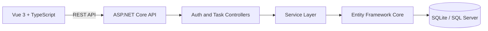

# Task Management System

[](https://github.com/Tofuhsu/task-management-system/actions/workflows/ci.yml)

A full-stack, multi-user task management application built with ASP.NET Core, Entity Framework Core, Vue 3, and TypeScript.

Users can register, sign in, and manage a private task workspace with server-side search, filtering, sorting, pagination, and dashboard summaries.

## Highlights

* JWT-based authentication with ASP.NET Core password hashing
* Authentication token stored in an `HttpOnly`, `SameSite=Strict` cookie
* Per-user authorization checks on every task read and write
* RESTful CRUD endpoints with DTO and service layers
* Server-side pagination, search, filtering, and allow-listed sorting
* Dashboard summaries generated with an aggregate database query
* Request validation with field-level Problem Details responses
* Centralized exception handling and structured logging
* SQLite for zero-setup local development
* SQL Server provider and migration support
* Responsive Vue 3 interface with loading, empty, validation, and API error states
* ASP.NET Core integration tests using isolated temporary databases
* GitHub Actions CI for backend tests and frontend security/build checks

## Tech Stack

| Layer          | Technology                                                    |
| -------------- | ------------------------------------------------------------- |
| Backend        | ASP.NET Core 10 Web API                                       |
| Authentication | JWT Bearer, `HttpOnly` cookies, ASP.NET Core `PasswordHasher` |
| Data Access    | Entity Framework Core 10                                      |
| Databases      | SQLite for local development, SQL Server support              |
| Frontend       | Vue 3, TypeScript, Axios, Vite                                |
| Testing        | xUnit, ASP.NET Core `WebApplicationFactory`, isolated SQLite  |
| CI             | GitHub Actions                                                |

## Architecture



The controllers handle HTTP and authentication concerns, while the service layer contains account and task behavior. DTOs define the public API contract, and Entity Framework Core manages persistence.

Every task query includes the authenticated `UserId`. If one user attempts to access another user's task—even with a valid task ID—the API returns `404`.

## Project Structure

```text
task-management-system/
├── .github/
│   └── workflows/
│       └── ci.yml
├── backend/
│   ├── TaskManager.Api/
│   │   ├── Configuration/
│   │   ├── Controllers/
│   │   ├── Data/
│   │   ├── DTOs/
│   │   ├── Infrastructure/
│   │   ├── Migrations/
│   │   ├── Models/
│   │   ├── Services/
│   │   └── Program.cs
│   ├── TaskManager.Api.Tests/
│   └── TaskManager.sln
└── frontend/
    └── task-manager-web/
        ├── src/
        │   ├── assets/
        │   ├── services/
        │   ├── types/
        │   ├── App.vue
        │   └── main.ts
        └── package.json
```

## Features

### Authentication

* Account registration
* Email and password login
* Logout
* Current-user session endpoint
* Case-insensitive duplicate email prevention
* Salted password hashing
* JWT validation for signature, issuer, audience, lifetime, and expiration
* Browser authentication through an `HttpOnly` cookie
* Standard `Authorization: Bearer` support for non-browser clients

### Task Management

* Create, read, update, and delete tasks
* Change task status independently
* Private per-user task workspaces
* Keyword search
* Status and priority filters
* Due-date range filters
* Server-side pagination
* Allow-listed sorting
* Dashboard summary counts
* Overdue and due-today calculations

### Frontend

* Registration and login forms
* Authenticated task dashboard
* Create and edit task forms
* Status and priority controls
* Search and filtering
* Pagination
* Loading and empty states
* Client-side validation
* API error handling
* Responsive layout

## Run Locally

### Prerequisites

* .NET 10 SDK
* Node.js 20.19+ or 22.12+
* npm

Local development uses SQLite, so SQL Server and Docker are not required.

### 1. Clone the Repository

```bash
git clone https://github.com/Tofuhsu/task-management-system.git
cd task-management-system
```

### 2. Configure the Backend

Enter the API project:

```bash
cd backend/TaskManager.Api
```

Generate and store a local JWT signing key with .NET user secrets:

```bash
JWT_KEY=$(openssl rand -base64 48)
dotnet user-secrets set "Jwt:SigningKey" "$JWT_KEY"
unset JWT_KEY
```

The signing key is stored outside the repository and must not be committed.

### 3. Start the API

```bash
dotnet restore
dotnet build
dotnet run
```

The API defaults to:

```text
http://localhost:5100
```

Swagger is available in Development at:

```text
http://localhost:5100/swagger
```

The application creates a local SQLite database automatically.

### 4. Start the Frontend

Open a second terminal:

```bash
cd frontend/task-manager-web
cp .env.example .env.local
npm ci
npm run dev
```

Open:

```text
http://localhost:5173
```

Register an account and create your first task.

## Automated Tests

The integration test suite starts the real ASP.NET Core application in memory and uses a unique temporary SQLite database.

It does not require:

* A running API
* A local JWT secret
* SQL Server
* Access to the development `taskmanager.db`

Run the tests with:

```bash
cd backend
dotnet test TaskManager.sln
```

The test suite verifies:

1. Unauthenticated users cannot access protected task endpoints.
2. Registration returns a secure `HttpOnly`, `SameSite=Strict` cookie.
3. Incorrect passwords are rejected.
4. Duplicate emails are rejected regardless of letter case.
5. One user cannot read, update, change, or delete another user's task.

Expected result:

```text
Total tests: 5
Passed: 5
Failed: 0
Skipped: 0
```

## Continuous Integration

GitHub Actions runs automatically on every push and pull request to `main`.

### Backend Job

* Restores NuGet packages
* Builds the .NET solution in Release mode
* Runs all integration tests

### Frontend Job

* Installs dependencies with `npm ci`
* Runs `npm audit`
* Performs TypeScript type checking
* Creates a production Vite build

The CI workflow is located at:

```text
.github/workflows/ci.yml
```

## API Endpoints

### Authentication

| Method | Endpoint             | Description                                              |
| ------ | -------------------- | -------------------------------------------------------- |
| `POST` | `/api/auth/register` | Register an account and create an authentication cookie  |
| `POST` | `/api/auth/login`    | Verify credentials and refresh the authentication cookie |
| `GET`  | `/api/auth/me`       | Return the currently authenticated user                  |
| `POST` | `/api/auth/logout`   | Expire the authentication cookie                         |

### Tasks

All task endpoints require authentication.

| Method   | Endpoint                 | Description                                         |
| -------- | ------------------------ | --------------------------------------------------- |
| `GET`    | `/api/tasks`             | Search, filter, sort, and paginate the user's tasks |
| `GET`    | `/api/tasks/{id}`        | Get one owned task                                  |
| `GET`    | `/api/tasks/summary`     | Get dashboard summary counts                        |
| `POST`   | `/api/tasks`             | Create a task                                       |
| `PUT`    | `/api/tasks/{id}`        | Replace editable task fields                        |
| `PATCH`  | `/api/tasks/{id}/status` | Update task status                                  |
| `DELETE` | `/api/tasks/{id}`        | Delete a task                                       |

Example query:

```http
GET /api/tasks?page=1&pageSize=10&search=backend&status=Todo&priority=High&sortBy=DueDate&sortDirection=asc
```

Supported sorting fields:

* `CreatedAt`
* `Title`
* `DueDate`
* `Priority`
* `Status`

The maximum page size is 100.

## Validation and Error Handling

Invalid requests return `400 application/problem+json` with field-level messages and a request trace ID.

Example:

```json
{
  "title": "One or more validation errors occurred.",
  "status": 400,
  "errors": {
    "PageSize": [
      "The field PageSize must be between 1 and 100."
    ]
  },
  "traceId": "00-..."
}
```

Expected authentication and account errors return:

* `401 Unauthorized`
* `409 Conflict`

Unexpected errors return a safe `500` response, while the original exception is logged by the server.

## Security Decisions

* Passwords are stored only as salted hashes.
* Plaintext passwords are never persisted or logged.
* JWT signature, issuer, audience, lifetime, and expiration are validated.
* Browser JavaScript cannot read the authentication token because it is stored in an `HttpOnly` cookie.
* Authentication cookies use `SameSite=Strict`.
* Cookies use the `Secure` flag outside Development.
* CORS uses an explicit origin allow-list.
* Task IDs are always queried together with the authenticated `UserId`.
* Login errors do not reveal whether the email or password was incorrect.
* Local JWT secrets and SQLite database files are excluded from Git.

This account system is suitable for a portfolio application. A public production deployment should additionally consider managed OpenID Connect or OAuth, email verification, password recovery, login rate limiting, key rotation, and deployment-specific CSRF protection.

## SQL Server Support

The application uses SQLite in local Development but also includes SQL Server support.

To use SQL Server:

1. Set `DatabaseProvider` to `SqlServer`.
2. Provide `ConnectionStrings__DefaultConnection`.
3. Apply the migrations:

```bash
dotnet ef database update
```

The authentication migration is designed for a fresh database. It intentionally stops if an older SQL Server database already contains tasks without owners, because those records require an explicit ownership migration.

## Data Model

### User

* `Id`
* `Email`
* `PasswordHash`
* `CreatedAt`

### Task

* `Id`
* `UserId`
* `Title`
* `Description`
* `Status`
* `Priority`
* `DueDate`
* `IsCompleted`
* `CreatedAt`
* `UpdatedAt`

Each task belongs to exactly one user. Deleting a user also deletes that user's tasks through a cascade relationship.

## Future Improvements

* Login rate limiting
* Email verification and password recovery
* Managed OpenID Connect authentication option
* Docker Compose development environment
* Cloud deployment
* Documented performance and load-test measurements
* Expanded unit and integration test coverage

## Author

**Jeff (Hsuan-Fu) Hsu**

* GitHub: [Tofuhsu](https://github.com/Tofuhsu)
* Portfolio: [tofuhsu.github.io](https://tofuhsu.github.io/)
* LinkedIn: [hsuan-fu-hsu](https://www.linkedin.com/in/hsuan-fu-hsu/)
